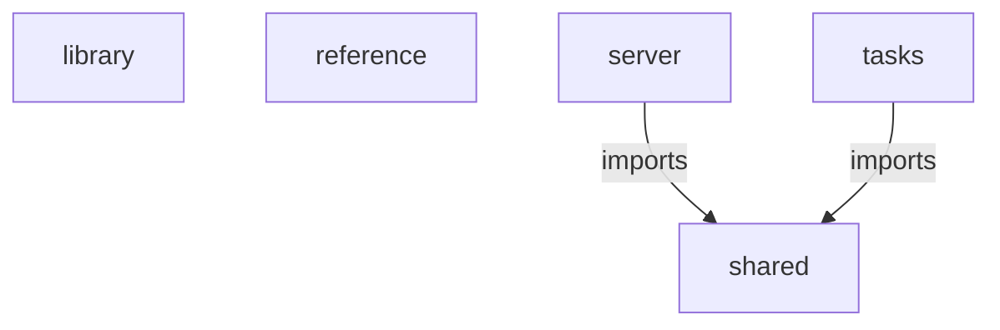

# Project structure

```mermaid
graph TD
  library["library"]
  reference["reference"]
  server["server"]
  shared["shared"]
  tasks["tasks"]
  server -->|imports| shared
  tasks -->|imports| shared
```
